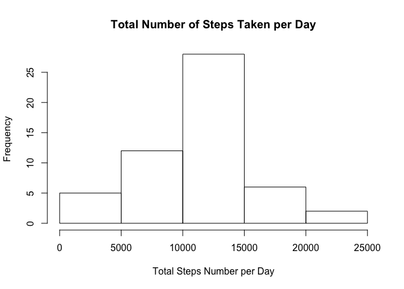
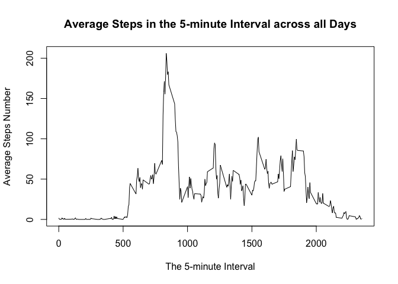
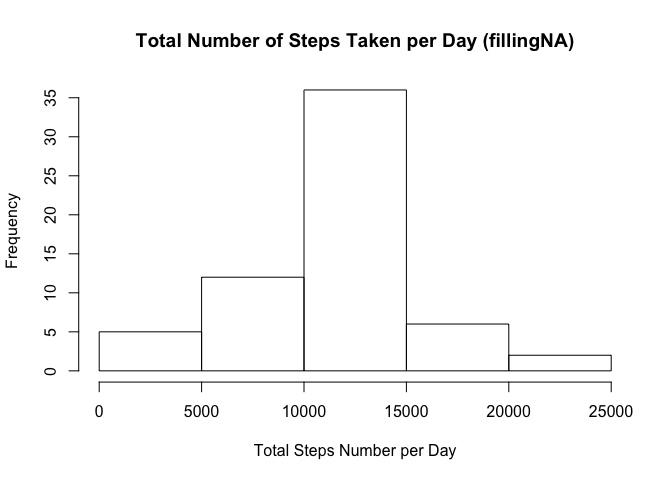
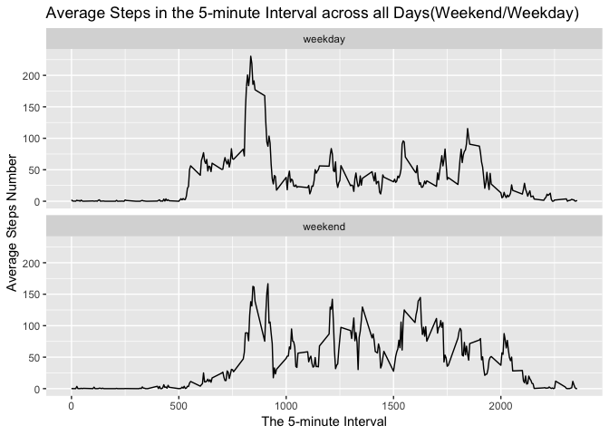

## Loading and preprocessing the data

Load the data (i.e. \color{red}{\verb|read.csv()|}read.csv())

```r
data<-read.csv("activity.csv")
```

Process/transform the data (if necessary) into a format suitable for your analysis

```r
library(dplyr)
```

```
## 
## Attaching package: 'dplyr'
```

```
## The following objects are masked from 'package:stats':
## 
##     filter, lag
```

```
## The following objects are masked from 'package:base':
## 
##     intersect, setdiff, setequal, union
```

## What is mean total number of steps taken per day?

1. Calculate the total number of steps taken per day

```r
stepdate <-subset(data, !is.na(steps), select=c(steps, date))
tnsbydate<- stepdate %>% 
    group_by(date) %>% 
    summarize(TotalSteps=sum(steps))
```

2. Make a histogram of the total number of steps taken each day

```r
hist(tnsbydate$TotalSteps, 
     xlab="Total Steps Number per Day", 
     main="Total Number of Steps Taken per Day")
```

<!-- -->

3. Calculate and report the mean and median of the total number of steps taken per day
mean

```r
mean(tnsbydate$TotalSteps)
```

```
## [1] 10766.19
```
median

```r
median(tnsbydate$TotalSteps)
```

```
## [1] 10765
```

## What is the average daily activity pattern?

1. Make a time series plot (i.e. \color{red}{\verb|type = "l"|}type="l") of the 5-minute interval (x-axis) and the average number of steps taken, averaged across all days (y-axis)

```r
stepinterval <-subset(data, !is.na(steps), select=c(steps, interval))
asbyinterval<- stepinterval %>% 
    group_by(interval) %>% 
    summarize(averageSteps=mean(steps))
plot(asbyinterval$interval, asbyinterval$averageSteps, 
     type="l",
     xlab="The 5-minute Interval",
     ylab="Average Steps Number",
     main="Average Steps in the 5-minute Interval across all Days")
```

<!-- -->

2. Which 5-minute interval, on average across all the days in the dataset, contains the maximum number of steps?

```r
mv <-asbyinterval[which.max(asbyinterval$averageSteps),1]
print(mv[[1]])
```

```
## [1] 835
```

## Imputing missing values

1. Calculate and report the total number of missing values in the dataset (i.e. the total number of rows with \color{red}{\verb|NA|}NAs)

```r
sum(is.na(data))
```

```
## [1] 2304
```
2. Devise a strategy for filling in all of the missing values in the dataset. The strategy does not need to be sophisticated. For example, you could use the mean/median for that day, or the mean for that 5-minute interval, etc.
3. Create a new dataset that is equal to the original dataset but with the missing data filled in.

```r
#filling steps NA by the average number of steps taken of the 5-minute interval across all days
fillingNA <-data
for (i in 1:nrow(fillingNA)){
      if(is.na(fillingNA$steps[i])){
            fillingNA$steps[i] <-asbyinterval$averageSteps[asbyinterval$interval==fillingNA$interval[i]]
      }
}
```

4. Make a histogram of the total number of steps taken each day and Calculate and report the mean and median total number of steps taken per day. Do these values differ from the estimates from the first part of the assignment? What is the impact of imputing missing data on the estimates of the total daily number of steps?

```r
fNAbydate<- fillingNA %>% 
    group_by(date) %>% 
    summarize(TotalSteps=sum(steps))
hist(fNAbydate$TotalSteps, 
     xlab="Total Steps Number per Day", 
     main="Total Number of Steps Taken per Day (fillingNA)")
```

<!-- -->

mean (filling in all of the missing values)

```r
mean(fNAbydate$TotalSteps)
```

```
## [1] 10766.19
```
median (filling in all of the missing values)

```r
median(fNAbydate$TotalSteps)
```

```
## [1] 10766.19
```
The mean value stayed the same, meanwhile the median value slightly increased after filling the missing values with the average number of steps taken of the 5-minute interval across all days. 

## Are there differences in activity patterns between weekdays and weekends?

1. Create a new factor variable in the dataset with two levels – “weekday” and “weekend” indicating whether a given date is a weekday or weekend day.

```r
fillingNA$date <-as.Date(fillingNA$date,"%Y-%m-%d")
fillingNA$day <-weekdays(fillingNA$date)
fillingNA$day[fillingNA$day %in% c('Saturday','Sunday') ] <- "weekend"
fillingNA$day[fillingNA$day !='weekend' ] <- "weekday"
fillingNA$day <-as.factor(fillingNA$day)
```
2. Make a panel plot containing a time series plot (i.e. \color{red}{\verb|type = "l"|}type="l") of the 5-minute interval (x-axis) and the average number of steps taken, averaged across all weekday days or weekend days (y-axis). See the README file in the GitHub repository to see an example of what this plot should look like using simulated data.

```r
#prepare for plotting
asbydayint <- fillingNA %>%
    group_by(day, interval) %>%
    summarize(averageSteps=mean(steps))
#plot
library(ggplot2)
q<-qplot(interval, averageSteps, data=asbydayint,
      geom="line",
      xlab="The 5-minute Interval",
      ylab="Average Steps Number",
      main="Average Steps in the 5-minute Interval across all Days(Weekend/Weekday)")+
      facet_wrap(~day,ncol=1)
print(q)
```

<!-- -->
